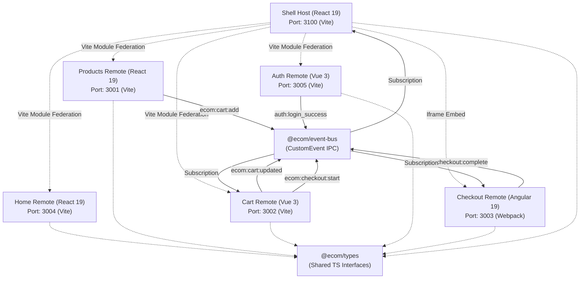
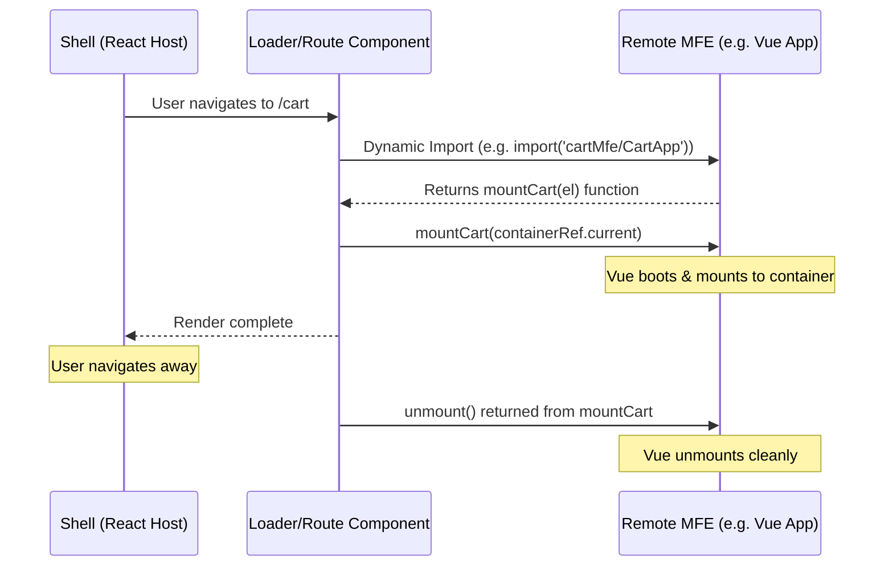

# HarborMart Project Analysis

This document provides a comprehensive technical analysis of the **HarborMart Ecommerce Microfrontend (MFE) Platform** repository.

---

## 1. Architectural Overview

HarborMart is a polyglot micro-frontend application built inside an **Nx Monorepo**. The host/orchestrator (Shell) dynamically resolves and mounts remotes at runtime.

### High-Level Architecture Diagram



---

## 2. Component/MFE Breakdown

The project contains 6 applications in the `apps/` directory and 2 shared libraries in the `libs/shared/` directory.

### 2.1 Apps Inventory

| App Directory | Target Port | Framework | Bundler | Federation Strategy | Description / Core Role |
| :--- | :--- | :--- | :--- | :--- | :--- |
| [`shell`](file:///c:/Users/dutta/Desktop/PersonalProjects/Ecommerce/Ecommerce-MFEs/apps/shell) | `3100` | React 19 | Vite 8 | Host | Main container, global layout (navbar, footer, global search), client routing via React Router, dynamic lazy-loading and mounting of remotes, and event orchestration. |
| [`home-mfe`](file:///c:/Users/dutta/Desktop/PersonalProjects/Ecommerce/Ecommerce-MFEs/apps/home-mfe) | `3004` | React 19 | Vite 7 | Remote | Landing/Welcome page. Contains the main promotional banners, product highlight carousels, and deals. |
| [`products-mfe`](file:///c:/Users/dutta/Desktop/PersonalProjects/Ecommerce/Ecommerce-MFEs/apps/products-mfe) | `3001` | React 19 | Vite 8 | Remote | Product catalog. Implements catalog searches, filters (by price, category), sorting, grid/list view selection, product details, and handles dispatching "Add to Cart" events. Powered by Redux Toolkit + RTK Query. |
| [`cart-mfe`](file:///c:/Users/dutta/Desktop/PersonalProjects/Ecommerce/Ecommerce-MFEs/apps/cart-mfe) | `3002` | Vue 3 | Vite 8 | Remote | Shopping cart module. Manages items in the cart, modifies quantities, calculates totals (tax, subtotal, shipping), persists state to `localStorage`, and coordinates checkout triggers. Powered by Pinia. |
| [`auth-mfe`](file:///c:/Users/dutta/Desktop/PersonalProjects/Ecommerce/Ecommerce-MFEs/apps/auth-mfe) | `3005` | Vue 3 | Vite 8 | Remote | Authentication interface. Login and sign-up forms, managing session details. Powered by Pinia. |
| [`checkout-mfe`](file:///c:/Users/dutta/Desktop/PersonalProjects/Ecommerce/Ecommerce-MFEs/apps/checkout-mfe) | `3003` | Angular 19 | Webpack 5 | Webpack MF | Enterprise-grade checkout forms and workflow (Shipping details, Payment selection, Order confirmation). Uses Zustand for vanilla JavaScript state management. Integrated in the Shell using a seamless iframe. |

### 2.2 Shared Libraries

1. **[`@ecom/event-bus`](file:///c:/Users/dutta/Desktop/PersonalProjects/Ecommerce/Ecommerce-MFEs/libs/shared/event-bus/src/index.ts)**:
   - Type-safe, browser-native event bus utilizing `CustomEvent` dispatched on the `window` object.
   - Decoupled mechanism for communication between MFEs.
   
2. **[`@ecom/types`](file:///c:/Users/dutta/Desktop/PersonalProjects/Ecommerce/Ecommerce-MFEs/libs/shared/types/src/index.ts)**:
   - Contains mutual TypeScript interfaces (`Product`, `CartItem`, `ShippingInfo`, `PaymentInfo`, `CheckoutStep`) shared across all React, Vue, and Angular applications to maintain API/data structure consistency.

---

## 3. Integration Patterns

### 3.1 Framework-Agnostic Mounting
Vite Module Federation exposes a `bootstrap.ts(x)` from each remote. Instead of sharing runtime dependencies like React/Vue DOM across boundaries, each remote exports a standard `default` mount function:

```typescript
export default function mountMfe(el: HTMLElement | string): () => void
```

The Shell imports this function dynamically, obtains a reference to a DOM target (`useRef`), invokes the mount function, and stores the returned teardown/unmount function to execute in the cleanup lifecycle (`useEffect`).



### 3.2 Inter-MFE Event Flow
Communication relies entirely on `CustomEvents` through `libs/shared/event-bus`.

```
[Products MFE (React)]
      │
      │ ecom:cart:add (Payload: Product details)
      ▼
[Window CustomEvent Bus]
      │
      │ (Subscription)
      ▼
[Cart MFE (Vue/Pinia)] ──(Updates Total)──► ecom:cart:updated (Payload: count)
                                                   │
                                                   ▼
                                        [Shell Host (React)]
                                                   │
                                            (Updates badge)
```

---

## 4. Key Configurations & Tooling

- **Nx Workspace (`nx.json`)**: Configured with Vite (`@nx/vite/plugin`) and Next.js targets, using smart workspace caching.
- **Port Management**: [`scripts/free-dev-ports.mjs`](file:///c:/Users/dutta/Desktop/PersonalProjects/Ecommerce/Ecommerce-MFEs/scripts/free-dev-ports.mjs) runs pre-dev to clean up hanging node processes on ports `3001`-`3005` and `3100`.
- **Prettier & TypeScript Base Path Mapping**: Root `tsconfig.base.json` registers alias paths like `@ecom/event-bus` and `@ecom/types` to resolve code directly from `libs/shared/`.

---

## 5. Potential Improvement Areas

1. **Checkout Integration**: The Checkout MFE is loaded via an `iframe` with a hardcoded URL (`http://localhost:3003/`). The shell uses an error boundary, but because Webpack MF is used for Angular, direct runtime ESM module federation integration could be researched (e.g. with newer Angular Vite bundlers or Custom Elements wrappers if needed).
2. **Redundant Zustand Store**: There is a Zustand store configuration file (`apps/checkout-mfe/store/checkoutStore.ts`) in the checkout MFE that isn't imported or used by the Angular components (which instead use `CheckoutService` with a RxJS `BehaviorSubject`). This can be safely removed or resolved.
3. **Consistency of Vite Config Extensions**: Home MFE uses `vite.config.mts` while others use `vite.config.ts`. Aligning extensions and shared configurations would improve consistency.
